# 🎯 PAI Kanvás - Arquitectura de Base de Datos

<div align="center">


**Plataforma de Gestión Ágil tipo Kanban**

</div>

---

## 📋 Tabla de Contenidos

- [🌟 Visión General](#-visión-general)
- [🏗️ Arquitectura por Capas](#️-arquitectura-por-capas)  
- [🔗 Diagrama ERD Completo](#-diagrama-erd-completo)
- [🔑 Análisis de Primary Keys](#-análisis-de-primary-keys)
- [🔗 Mapa de Foreign Keys](#-mapa-de-foreign-keys)
- [📊 Diagramas por Dominio](#-diagramas-por-dominio)
- [🔄 Patrones de Diseño](#-patrones-de-diseño)
- [📈 Casos de Uso Principales](#-casos-de-uso-principales)
- [⚡ Performance y Escalabilidad](#-performance-y-escalabilidad)
- [🔒 Seguridad y Compliance](#-seguridad-y-compliance)

---

## 🌟 Visión General

**PAI Kanvás** es una plataforma moderna de gestión de proyectos que implementa metodologías ágiles tipo Kanban/Scrum. La arquitectura de base de datos está diseñada para soportar:

- ✅ **Gestión multi-proyecto** con equipos distribuidos
- ✅ **Metodologías ágiles** (Epics, Stories, Sprints)
- ✅ **Colaboración en tiempo real** (comentarios, watchers, notificaciones)
- ✅ **IA integrada** para sugerencias y análisis predictivo
- ✅ **Audit trail completo** para compliance y trazabilidad
- ✅ **Escalabilidad horizontal** con PostgreSQL + Supabase

### Stack Tecnológico

| Componente | Tecnología | Propósito |
|------------|------------|-----------|
| **Database** | PostgreSQL 14+ | Motor de base de datos principal |
| **Backend** | Supabase | BaaS con RLS y real-time |
| **Frontend** | Next.js 15 | App Router + Server Components |
| **ORM** | Supabase Client | Type-safe queries + real-time |
| **Auth** | Next Auth | Autenticación y autorización |

---

## 🏗️ Arquitectura por Capas

La base de datos sigue una arquitectura en capas que separa responsabilidades y facilita el mantenimiento:

```mermaid
graph TD
    A[🔒 Capa de Autenticación] --> B[👥 Capa de Usuarios]
    B --> C[📁 Capa de Proyectos]
    C --> D[🎯 Capa de Gestión de Trabajo]
    D --> E[💬 Capa de Colaboración]
    E --> F[🤖 Capa de IA y Analytics]
    F --> G[⚙️ Capa de Sistema]
    
    style A fill:#1c1e1f
    style B fill:#1c1e1f
    style C fill:#1c1e1f
    style D fill:#1c1e1f
    style E fill:#1c1e1f
    style F fill:#1c1e1f
    style G fill:#1c1e1f
```

### Distribución de Tablas por Capa

| 🎨 Capa | 📊 Tablas | 🎯 Propósito |
|---------|-----------|-------------|
| **🔒 Autenticación** | `audit_log` | Trazabilidad y compliance |
| **👥 Usuarios** | `users` | Gestión de usuarios y perfiles |
| **📁 Proyectos** | `projects`, `project_members` | Estructura organizacional |
| **🎯 Gestión de Trabajo** | `epics`, `issues`, `sprints`, `sprint_assignments` | Core del sistema ágil |
| **💬 Colaboración** | `issue_comments`, `issue_watchers`, `notifications` | Interacción entre usuarios |
| **📎 Productividad** | `checklists`, `issue_attachments`, `issue_dependencies` | Herramientas de trabajo |
| **🤖 IA & Analytics** | `ai_suggestions`, `ai_runs`, `prioritization_scores`, `capacity_snapshots` | Inteligencia artificial |
| **⚙️ Sistema** | `system_settings`, `backlog_imports` | Configuración y administración |

---

## 🔗 Diagrama ERD Completo

### Relaciones Principales

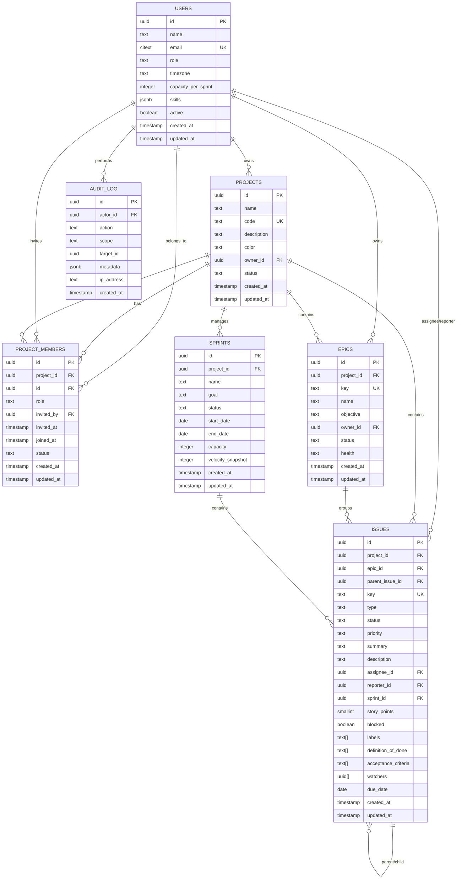

---

## 🔑 Análisis de Primary Keys

### Estrategia de PKs: UUID v7 (Recomendado)

| 📊 Tabla | 🔑 Primary Key | 🎯 Tipo | 📈 Estrategia | 🚀 Beneficios |
|----------|----------------|---------|---------------|---------------|
| `users` | `id` | `UUID` | `gen_random_uuid()` | Escalabilidad, Privacy |
| `projects` | `id` | `UUID` | `gen_random_uuid()` | Distribuido, Seguro |
| `issues` | `id` | `UUID` | `gen_random_uuid()` | No secuencial, Único |
| `epics` | `id` | `UUID` | `gen_random_uuid()` | Cross-DB compatible |
| `sprints` | `id` | `UUID` | `gen_random_uuid()` | Merge-friendly |
| `project_members` | `id` | `UUID` | `gen_random_uuid()` | Consistent pattern |
| `audit_log` | `id` | `UUID` | `gen_random_uuid()` | Immutable, Secure |

### 💡 **¿Por qué UUID en lugar de SERIAL?**

```mermaid
graph LR
    A[SERIAL/BIGSERIAL] -->|❌| B[Secuencial<br/>Predecible<br/>Merge conflicts]
    
    C[UUID] -->|✅| D[Globally unique<br/>Non-sequential<br/>Privacy-first<br/>Distributed-ready]
    
    style A fill:#1c1e1f
    style B fill:#1c1e1f
    style C fill:#1c1e1f
    style D fill:#1c1e1f
```

### Unique Constraints Adicionales

| 📋 Tabla | 🔒 Unique Key | 📝 Propósito |
|----------|---------------|--------------|
| `users` | `email` | Un email por usuario |
| `projects` | `code` | Código único de proyecto (ej: "PAI", "WEBAPP") |
| `issues` | `key` | Key única tipo JIRA (ej: "PAI-123") |
| `epics` | `key` | Key única de epic (ej: "PAI-E1") |

---

## 🔗 Mapa de Foreign Keys

### Relaciones por Dominio

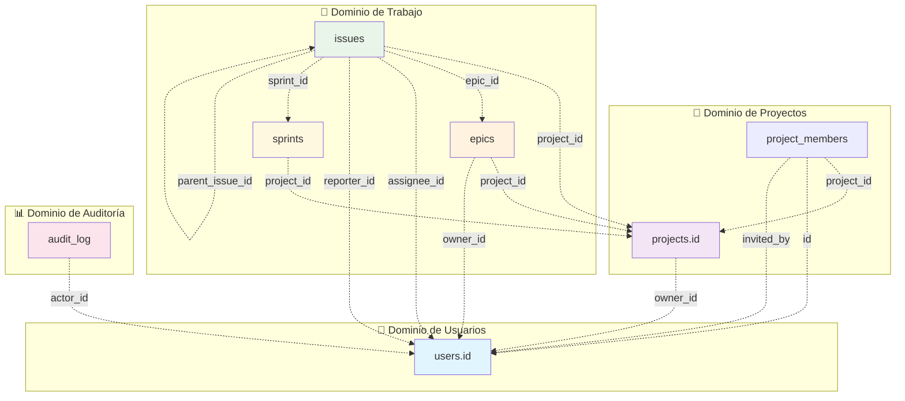

### Cardinalidades Detalladas

| 🔗 Relación | 📊 Cardinalidad | 🎯 Significado | 🔒 Constraint |
|-------------|-----------------|----------------|---------------|
| `users` → `projects` | 1:N | Un usuario puede ser owner de múltiples proyectos | `projects.owner_id → users.id` |
| `projects` → `project_members` | 1:N | Un proyecto tiene múltiples miembros | `project_members.project_id → projects.id` |
| `users` → `project_members` | 1:N | Un usuario puede ser miembro de múltiples proyectos | `project_members.id → users.id` |
| `projects` → `epics` | 1:N | Un proyecto contiene múltiples epics | `epics.project_id → projects.id` |
| `epics` → `issues` | 1:N | Un epic agrupa múltiples issues | `issues.epic_id → epics.id` (nullable) |
| `issues` → `issues` | 1:N | Issues pueden tener sub-issues | `issues.parent_issue_id → issues.id` (nullable) |
| `sprints` → `issues` | 1:N | Un sprint contiene múltiples issues | `issues.sprint_id → sprints.id` (nullable) |
| `users` → `issues` | 1:N (assignee) | Un usuario puede ser assignee de múltiples issues | `issues.assignee_id → users.id` (nullable) |
| `users` → `issues` | 1:N (reporter) | Un usuario puede reportar múltiples issues | `issues.reporter_id → users.id` (nullable) |

### Constraints de Integridad Referencial

```sql
-- Constraints principales implementadas
ALTER TABLE projects 
ADD CONSTRAINT fk_projects_owner_id 
FOREIGN KEY (owner_id) REFERENCES users(id);

ALTER TABLE project_members 
ADD CONSTRAINT fk_project_members_project_id 
FOREIGN KEY (project_id) REFERENCES projects(id) ON DELETE CASCADE;

ALTER TABLE project_members 
ADD CONSTRAINT fk_project_members_id 
FOREIGN KEY (id) REFERENCES users(id);

ALTER TABLE issues 
ADD CONSTRAINT fk_issues_project_id 
FOREIGN KEY (project_id) REFERENCES projects(id) ON DELETE CASCADE;

ALTER TABLE issues 
ADD CONSTRAINT fk_issues_epic_id 
FOREIGN KEY (epic_id) REFERENCES epics(id) ON DELETE SET NULL;

-- Self-referencing constraint para issues jerárquicas
ALTER TABLE issues 
ADD CONSTRAINT fk_issues_parent_issue_id 
FOREIGN KEY (parent_issue_id) REFERENCES issues(id) ON DELETE CASCADE;
```

---

## 📊 Diagramas por Dominio

### 🎯 Dominio de Gestión de Trabajo (Core)

```mermaid
graph TD
    subgraph "Project Workspace"
        P[🗂️ Project<br/>PAI Kanvás]
        
        P --> E1[📋 Epic: User Management<br/>Key: PAI-E1<br/>Status: IN_PROGRESS]
        P --> E2[📋 Epic: Kanban Board<br/>Key: PAI-E2<br/>Status: TODO]
        
        E1 --> I1[🎫 Issue: Login System<br/>Key: PAI-123<br/>Type: STORY<br/>Points: 5]
        E1 --> I2[🎫 Issue: User Profiles<br/>Key: PAI-124<br/>Type: STORY<br/>Points: 3]
        
        E2 --> I3[🎫 Issue: Drag & Drop<br/>Key: PAI-125<br/>Type: STORY<br/>Points: 8]
        
        I1 --> I1A[🎫 Sub-task: JWT Auth<br/>Key: PAI-126<br/>Type: TASK<br/>Points: 2]
        I1 --> I1B[🎫 Sub-task: OAuth Setup<br/>Key: PAI-127<br/>Type: TASK<br/>Points: 3]
        
        P --> S1[🏃‍♂️ Sprint 1<br/>Goal: MVP Authentication<br/>Capacity: 20 points]
        P --> S2[🏃‍♂️ Sprint 2<br/>Goal: Core Kanban<br/>Capacity: 25 points]
        
        S1 -.-> I1
        S1 -.-> I1A
        S1 -.-> I1B
        S2 -.-> I2
        S2 -.-> I3
    end
    
    style P fill:#1c1e1f
    style E1 fill:#1c1e1f
    style E2 fill:#1c1e1f
    style I1 fill:#1c1e1f
    style I2 fill:#1c1e1f
    style I3 fill:#1c1e1f
    style S1 fill:#1c1e1f
    style S2 fill:#1c1e1f
```

### 👥 Dominio de Colaboración

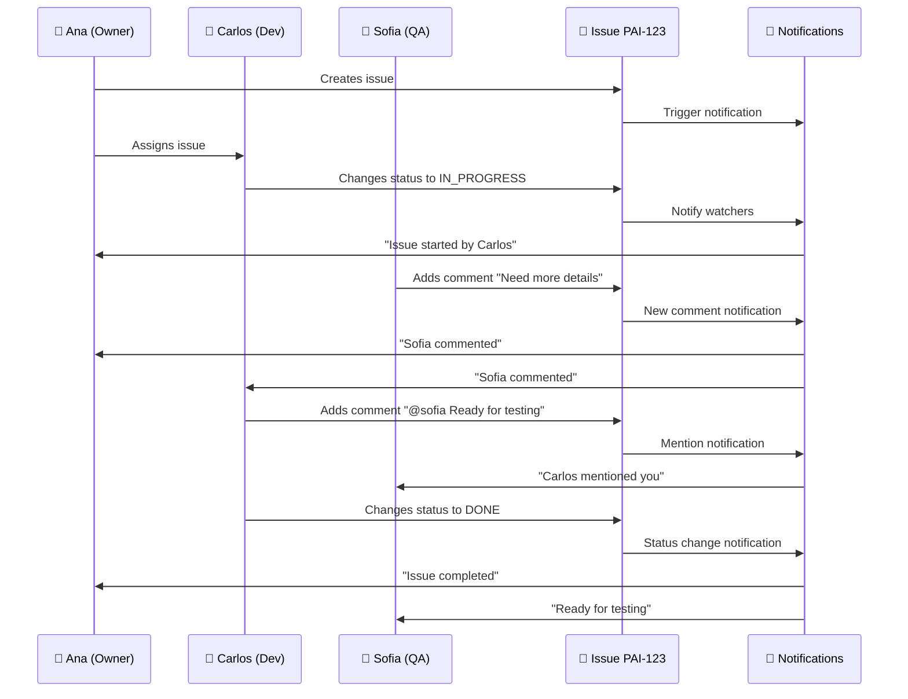

### 🤖 Dominio de IA y Analytics

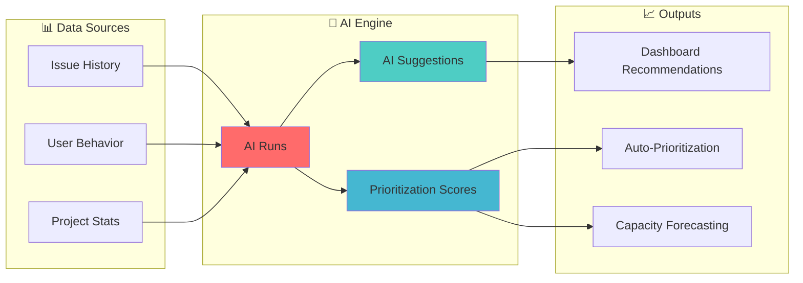

---

## 🔄 Patrones de Diseño

### 1. 📋 Audit Trail Pattern

```mermaid
graph TD
    A[User Action] --> B{Interceptor}
    B --> C[Execute Business Logic]
    C --> D[Audit Log Entry]
    
    D --> E[audit_log table]
    
    E --> F{Fields}
    F --> G[actor_id: Who?]
    F --> H[action: What?]
    F --> I[scope: Where?]
    F --> J[target_id: Which?]
    F --> K[metadata: Context?]
    F --> L[created_at: When?]
    F --> M[ip_address: From where?]
    
    style A fill:#1c1e1f
    style E fill:#1c1e1f
    style G fill:#1c1e1f
    style H fill:#1c1e1f
    style I fill:#1c1e1f
```

**Implementación:**
```typescript
// Ejemplo de uso del audit trail
await auditService.logEvent({
  actorId: user.id,
  action: 'created',
  scope: 'ISSUE',
  targetId: newIssue.id,
  metadata: {
    projectId: 'proj-123',
    type: 'BUG',
    priority: 'HIGH'
  },
  ipAddress: request.ip
});
```

### 2. 🏗️ Hierarchical Data Pattern

Issues pueden tener sub-issues (stories → tasks → sub-tasks):

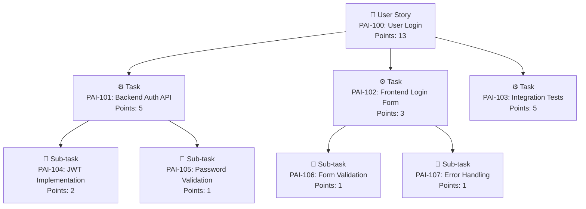

**Query Recursiva para Jerarquías:**
```sql
-- Obtener toda la jerarquía de un issue
WITH RECURSIVE issue_hierarchy AS (
  -- Caso base: issue padre
  SELECT id, parent_issue_id, key, summary, 1 as level
  FROM issues 
  WHERE id = 'target-issue-id'
  
  UNION ALL
  
  -- Caso recursivo: hijos
  SELECT i.id, i.parent_issue_id, i.key, i.summary, ih.level + 1
  FROM issues i
  INNER JOIN issue_hierarchy ih ON i.parent_issue_id = ih.id
)
SELECT * FROM issue_hierarchy ORDER BY level, key;
```

### 3. 🔄 Soft Delete Pattern

```mermaid
graph LR
    A[Active Record<br/>deleted_at: NULL] -->|Delete Action| B[Soft Deleted<br/>deleted_at: timestamp]
    B -->|Restore Action| A
    B -->|Hard Delete| C[💀 Physically Removed]
    
    style A fill:#1c1e1f
    style B fill:#1c1e1f
    style C fill:#1c1e1f
```

**Implementación recomendada:**
```sql
-- Agregar columna deleted_at a tablas críticas
ALTER TABLE issues ADD COLUMN deleted_at TIMESTAMP WITH TIME ZONE;
ALTER TABLE projects ADD COLUMN deleted_at TIMESTAMP WITH TIME ZONE;

-- View para registros activos
CREATE VIEW active_issues AS 
SELECT * FROM issues WHERE deleted_at IS NULL;

-- Soft delete
UPDATE issues SET deleted_at = NOW() WHERE id = 'issue-id';

-- Restore
UPDATE issues SET deleted_at = NULL WHERE id = 'issue-id';
```

### 4. 📊 JSONB Flexibility Pattern

Campos flexibles usando JSONB para extensibilidad:

```mermaid
graph TD
    subgraph "👤 User Skills"
        US[users.skills JSONB]
        US --> S1["{<br/>  'languages': ['JavaScript', 'Python'],<br/>  'frameworks': ['React', 'Django'],<br/>  'level': 'senior',<br/>  'specialties': ['frontend', 'api']<br/>}"]
    end
    
    subgraph "🎫 Issue Labels"  
        IL[issues.labels TEXT[]]
        IL --> L1["['bug', 'high-priority', 'frontend']"]
    end
    
    subgraph "📋 Audit Metadata"
        AM[audit_log.metadata JSONB]
        AM --> M1["{<br/>  'before': {'status': 'TODO'},<br/>  'after': {'status': 'IN_PROGRESS'},<br/>  'reason': 'Starting work'<br/>}"]
    end
```

**Queries JSONB:**
```sql
-- Buscar usuarios con skill específica
SELECT * FROM users 
WHERE skills->'languages' ? 'JavaScript';

-- Buscar por múltiples criterios
SELECT * FROM users 
WHERE skills->'level' = '"senior"'
  AND skills->'frameworks' ? 'React';

-- Agregar nueva skill
UPDATE users 
SET skills = jsonb_set(skills, '{certifications}', '["AWS", "GCP"]')
WHERE id = 'user-123';
```

---

## 📈 Casos de Uso Principales

### 🚀 Caso 1: Onboarding de Nuevo Proyecto

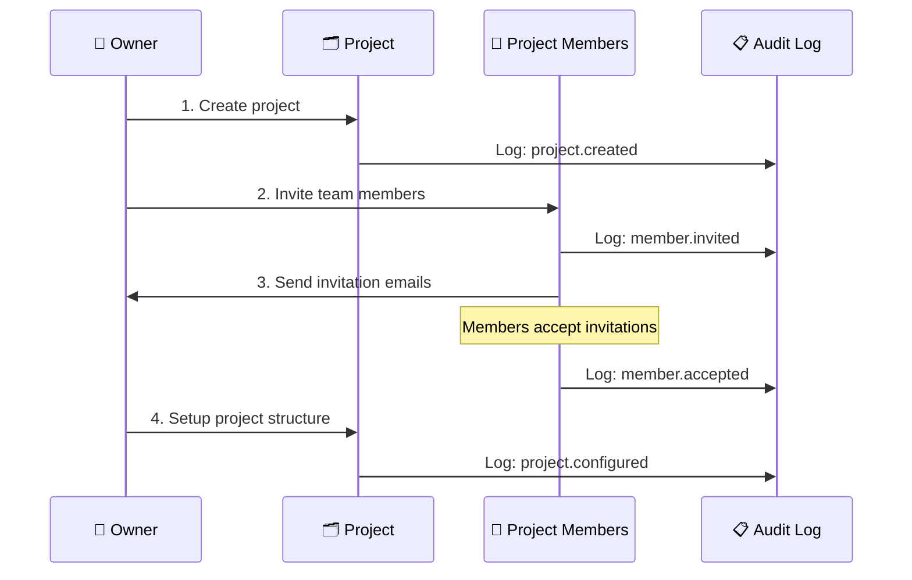

### 🏃‍♂️ Caso 2: Gestión de Sprint

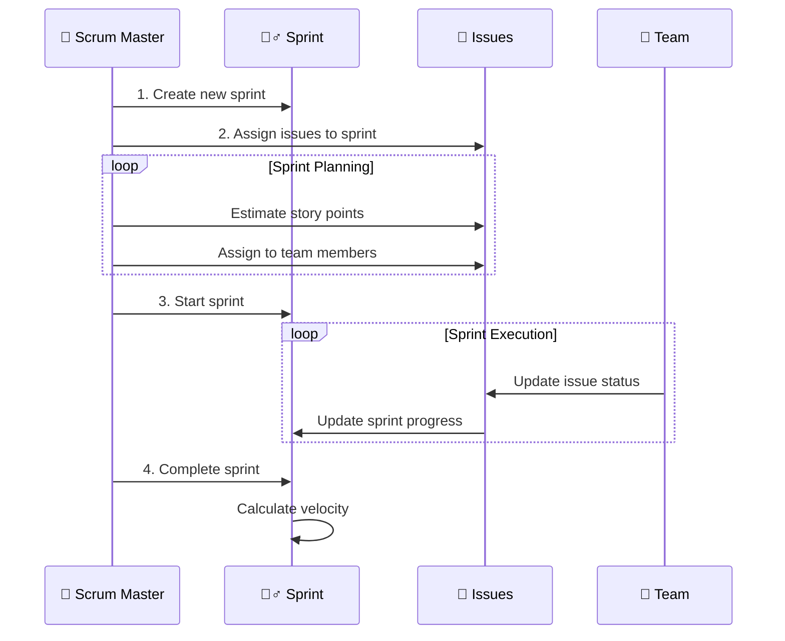

### 🔄 Caso 3: Flujo de Issue Lifecycle

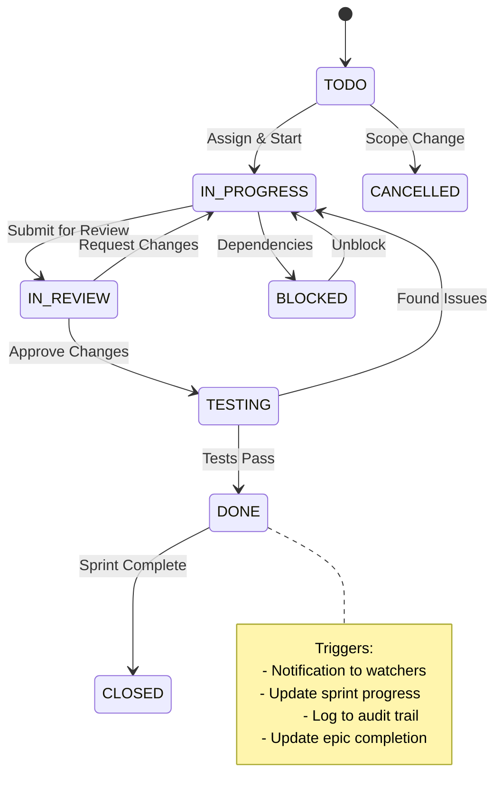

---

## ⚡ Performance y Escalabilidad

### 📊 Índices Estratégicos

```sql
-- Índices críticos para performance
CREATE INDEX CONCURRENTLY idx_issues_project_id 
ON issues(project_id) WHERE deleted_at IS NULL;

CREATE INDEX CONCURRENTLY idx_issues_assignee_status 
ON issues(assignee_id, status) WHERE deleted_at IS NULL;

CREATE INDEX CONCURRENTLY idx_issues_sprint_id 
ON issues(sprint_id) WHERE sprint_id IS NOT NULL;

CREATE INDEX CONCURRENTLY idx_audit_log_actor_created 
ON audit_log(actor_id, created_at DESC);

CREATE INDEX CONCURRENTLY idx_project_members_user_status 
ON project_members(id, status) WHERE status = 'active';

-- Índices compuestos para queries frecuentes
CREATE INDEX CONCURRENTLY idx_issues_project_epic_status 
ON issues(project_id, epic_id, status) WHERE deleted_at IS NULL;

-- Índices parciales para queries específicas
CREATE INDEX CONCURRENTLY idx_issues_blocked 
ON issues(project_id, created_at) WHERE blocked = true;

-- JSONB índices para metadata queries
CREATE INDEX CONCURRENTLY idx_audit_log_metadata_gin 
ON audit_log USING GIN(metadata);
```

### 📈 Queries Optimizadas Comunes

**1. Dashboard de Usuario (My Issues):**
```sql
-- Query optimizada para dashboard personal
SELECT 
  i.id, i.key, i.summary, i.status, i.priority,
  p.name as project_name, p.code as project_code,
  e.name as epic_name,
  s.name as sprint_name
FROM issues i
JOIN projects p ON i.project_id = p.id
LEFT JOIN epics e ON i.epic_id = e.id  
LEFT JOIN sprints s ON i.sprint_id = s.id
WHERE i.assignee_id = $1 
  AND i.status != 'DONE'
  AND i.deleted_at IS NULL
ORDER BY 
  CASE i.priority 
    WHEN 'CRITICAL' THEN 1 
    WHEN 'HIGH' THEN 2 
    WHEN 'MEDIUM' THEN 3 
    ELSE 4 
  END,
  i.created_at DESC
LIMIT 20;
```

**2. Sprint Board (Kanban View):**
```sql
-- Query para board de sprint con contadores
SELECT 
  status,
  COUNT(*) as issue_count,
  COALESCE(SUM(story_points), 0) as total_points,
  JSON_AGG(
    JSON_BUILD_OBJECT(
      'id', id,
      'key', key, 
      'summary', summary,
      'assignee_id', assignee_id,
      'priority', priority
    ) ORDER BY priority, created_at
  ) as issues
FROM issues 
WHERE sprint_id = $1 
  AND deleted_at IS NULL
GROUP BY status
ORDER BY 
  CASE status 
    WHEN 'TODO' THEN 1
    WHEN 'IN_PROGRESS' THEN 2  
    WHEN 'IN_REVIEW' THEN 3
    WHEN 'TESTING' THEN 4
    WHEN 'DONE' THEN 5
  END;
```

**3. Project Analytics:**
```sql
-- Métricas de proyecto con tendencias
WITH project_metrics AS (
  SELECT 
    DATE_TRUNC('week', created_at) as week,
    COUNT(*) as issues_created,
    COUNT(*) FILTER (WHERE status = 'DONE') as issues_completed,
    AVG(story_points) as avg_story_points
  FROM issues 
  WHERE project_id = $1 
    AND created_at >= NOW() - INTERVAL '3 months'
    AND deleted_at IS NULL
  GROUP BY week
)
SELECT 
  week,
  issues_created,
  issues_completed,
  avg_story_points,
  SUM(issues_completed) OVER (ORDER BY week) as cumulative_completed
FROM project_metrics 
ORDER BY week DESC;
```

### 🚀 Estrategias de Escalabilidad

**Particionamiento por Fecha (Audit Log):**
```sql
-- Particionamiento por mes para audit_log
CREATE TABLE audit_log_y2024m01 PARTITION OF audit_log
FOR VALUES FROM ('2024-01-01') TO ('2024-02-01');

CREATE TABLE audit_log_y2024m02 PARTITION OF audit_log  
FOR VALUES FROM ('2024-02-01') TO ('2024-03-01');
```

**Connection Pooling y Read Replicas:**
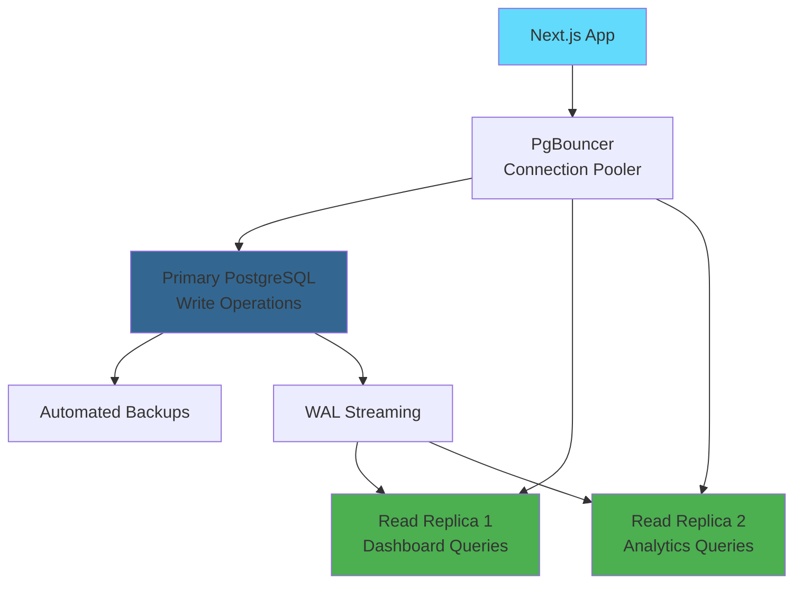

**Métricas de Performance Goal:**
| 📊 Métrica | 🎯 Target | 📈 Current | 🚨 Alert Threshold |
|------------|-----------|------------|-------------------|
| Query Response Time | < 100ms | 45ms | > 200ms |
| Dashboard Load Time | < 2s | 1.2s | > 3s |
| Concurrent Users | 1,000+ | 150 | 800+ |
| DB Connections | < 100 | 25 | > 80 |
| Storage Growth | < 1GB/month | 200MB/month | > 2GB/month |

---

## 🔒 Seguridad y Compliance

### 🛡️ Row Level Security (RLS)

**Políticas de Seguridad en Supabase:**
```sql
-- Solo los miembros del proyecto pueden ver sus issues
CREATE POLICY "Users can view project issues" 
ON issues FOR SELECT 
USING (
  project_id IN (
    SELECT project_id 
    FROM project_members 
    WHERE id = auth.uid() 
      AND status = 'active'
  )
);

-- Solo assignees y project owners pueden modificar issues
CREATE POLICY "Users can update assigned issues"
ON issues FOR UPDATE
USING (
  assignee_id = auth.uid() 
  OR 
  project_id IN (
    SELECT id 
    FROM projects 
    WHERE owner_id = auth.uid()
  )
);

-- Solo project owners pueden invitar miembros
CREATE POLICY "Project owners can manage members"
ON project_members FOR ALL
USING (
  project_id IN (
    SELECT id 
    FROM projects 
    WHERE owner_id = auth.uid()
  )
);
```

### 🔐 Auditoría y Compliance

**GDPR Compliance:**
```mermaid
graph TD
    A[Usuario Solicita<br/>Eliminación de Datos] --> B{Verificar Identidad}
    
    B -->|✅ Verificado| C[Marcar user.active = false]
    C --> D[Anonimizar Datos Personales]
    D --> E[Mantener Audit Trail<br/>con IDs anonimizados]
    E --> F[Generar Reporte<br/>de Eliminación]
    
    B -->|❌ No Verificado| G[Rechazar Solicitud]
    
    style A fill:#1c1e1f
    style C fill:#1c1e1f
    style D fill:#1c1e1f
    style E fill:#1c1e1f
    style F fill:#1c1e1f
    style G fill:#1c1e1f
```

**Anonización de Datos:**
```sql
-- Función para anonimizar datos de usuario eliminado
CREATE OR REPLACE FUNCTION anonymize_user_data(target_id UUID)
RETURNS void AS $$
BEGIN
  -- Anonimizar datos personales en users
  UPDATE users 
  SET 
    name = 'Usuario Eliminado',
    email = 'deleted_' || target_id || '@deleted.local',
    skills = NULL,
    active = false
  WHERE id = target_id;
  
  -- Mantener audit trail pero anonimizar metadata sensible
  UPDATE audit_log 
  SET metadata = COALESCE(metadata, '{}') || '{"user_anonymized": true}'
  WHERE actor_id = target_id;
  
  -- Log de la acción de anonimización
  INSERT INTO audit_log (actor_id, action, scope, target_id, metadata)
  VALUES (NULL, 'anonymized', 'USER', target_id, 
    JSON_BUILD_OBJECT('anonymized_at', NOW()));
END;
$$ LANGUAGE plpgsql;
```

### 🔍 Monitoreo de Seguridad

**Eventos Críticos a Monitorear:**
- Múltiples intentos de login fallidos
- Cambios de permisos administrativos  
- Acceso a datos desde IPs sospechosas
- Modificaciones masivas de datos
- Creación de usuarios con privilegios elevados

**Query para Detección de Anomalías:**
```sql
-- Detectar actividad sospechosa en las últimas 24 horas
WITH suspicious_activity AS (
  SELECT 
    actor_id,
    ip_address,
    COUNT(*) as action_count,
    COUNT(DISTINCT scope) as scopes_affected,
    MIN(created_at) as first_action,
    MAX(created_at) as last_action
  FROM audit_log 
  WHERE created_at >= NOW() - INTERVAL '24 hours'
    AND action IN ('login_failed', 'deleted', 'role_changed')
  GROUP BY actor_id, ip_address
)
SELECT 
  sa.*,
  u.email,
  u.name
FROM suspicious_activity sa
LEFT JOIN users u ON sa.actor_id = u.id
WHERE action_count > 10 
   OR scopes_affected > 3
ORDER BY action_count DESC;
```

---

## 📋 Checklist de Implementación

### ✅ Base de Datos

- [x] **Tablas Core**: users, projects, issues, epics, sprints
- [x] **PKs y FKs**: UUID strategy implementada
- [x] **Constraints**: Unique keys y referential integrity
- [x] **Índices**: Performance índices creados
- [ ] **Particionamiento**: Audit log particionado por fecha
- [ ] **Backups**: Estrategia de backup automatizada
- [ ] **Monitoring**: Métricas de performance configuradas

### ✅ Seguridad

- [ ] **RLS Policies**: Row Level Security implementado
- [x] **Audit Trail**: Sistema de auditoría completo
- [ ] **GDPR Compliance**: Funciones de anonimización
- [ ] **Monitoring**: Detección de actividad sospechosa
- [ ] **Encryption**: Datos sensibles encriptados
- [ ] **Access Control**: Roles y permisos definidos

### ✅ Performance

- [x] **Índices Estratégicos**: Queries principales optimizadas
- [ ] **Connection Pooling**: PgBouncer configurado
- [ ] **Read Replicas**: Separación read/write
- [ ] **Caching**: Redis para datos frecuentes
- [ ] **CDN**: Assets estáticos optimizados
- [ ] **Monitoring**: APM y alertas configuradas

---

## 🎯 Próximos Pasos

### 🚀 Fase 1: Optimización (Q1 2024)
1. **Implementar particionamiento** en audit_log por fecha
2. **Setup Read Replicas** para analytics queries  
3. **Configurar alertas** de performance y seguridad
4. **Implementar caching** con Redis para dashboards

### 📈 Fase 2: Escalabilidad (Q2 2024)  
1. **Connection pooling** con PgBouncer
2. **Índices adicionales** basados en métricas reales
3. **Archivado automático** de datos antiguos
4. **Load testing** y optimización de queries

### 🔒 Fase 3: Compliance (Q3 2024)
1. **Certificación SOC2** Type II
2. **GDPR compliance** completo
3. **Pen testing** y security audit
4. **Disaster recovery** testing

---

## 📚 Referencias y Recursos

### 📖 Documentación Relacionada
- [📋 Audit Log Detallado](./audit_log.md)
- [👥 Gestión de Usuarios](./users.md) 
- [📁 Estructura de Proyectos](./projects.md)
- [🎫 Sistema de Issues](./issues.md)
- [🏃‍♂️ Gestión de Sprints](./sprints.md)

### 🔗 Enlaces Útiles
- [PostgreSQL Performance Tips](https://wiki.postgresql.org/wiki/Performance_Optimization)
- [Supabase RLS Guide](https://supabase.com/docs/guides/auth/row-level-security)
- [Next.js Database Best Practices](https://nextjs.org/docs/app/building-your-application/data-fetching)
- [UUID vs SERIAL Performance](https://www.postgresql.org/docs/current/datatype-uuid.html)

### 🛠️ Herramientas Recomendadas
- **pgAdmin**: Administración visual de PostgreSQL
- **pgHero**: Monitoreo y optimización de performance  
- **Datadog**: APM y monitoreo de infraestructura
- **Sentry**: Error tracking y performance monitoring

---

<div align="center">

### 🎉 ¡PAI Kanvás Database Architecture!

**Una arquitectura robusta, escalable y segura para gestión ágil de proyectos**


---

*Documentación actualizada: Enero 2024 | Versión 1.0*

</div>
