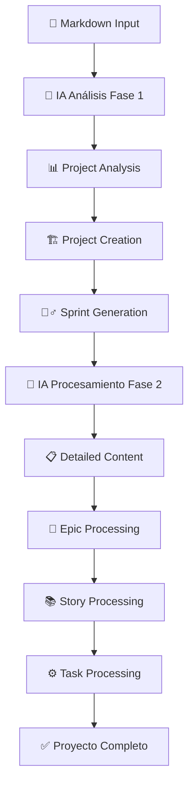

# Sistema de Importación con IA

## 🚀 Resumen

El **Sistema de Importación con IA** permite crear proyectos completos automáticamente desde especificaciones en markdown. Utiliza inteligencia artificial para analizar documentos, generar épicas, historias y tareas, y organizar todo en sprints secuenciales.

## ✨ Características Principales

- **🤖 IA Híbrida**: Procesamiento en 2 fases para máxima precisión
- **📂 Creación Automática**: Genera proyectos, sprints y asignaciones
- **🎯 Sprints Secuenciales**: 1 sprint por épica con fechas automáticas
- **⚡ Procesamiento Inteligente**: Maneja 100+ historias y tareas
- **🔧 Prioridades Textuales**: `CRÍTICA`, `ALTA`, `MEDIA`, `BAJA`, `PENDIENTE`
- **👨‍💻 Asignación Automática**: Todas las tareas al desarrollador especificado

## 🏗️ Arquitectura del Sistema



### Componentes Principales

1. **ImportOrchestrator**: Coordina todo el flujo de importación
2. **MarkdownProcessor**: Maneja las llamadas de IA híbridas
3. **ProjectCreationService**: Crea proyectos automáticamente
4. **SprintGenerationService**: Genera sprints secuenciales (1 por épica)
5. **EpicProcessingService**: Procesa y crea épicas
6. **StoryProcessingService**: Procesa historias de usuario
7. **TaskProcessingService**: Procesa tareas técnicas

## 🔄 Flujo de Procesamiento (8 Fases)

| Fase | Descripción | Responsable |
|------|-------------|-------------|
| 1️⃣ | **Análisis del Proyecto** | IA Primera Llamada |
| 2️⃣ | **Validación de Permisos** | ProjectCreationService |
| 3️⃣ | **Creación del Proyecto** | ProjectCreationService |
| 4️⃣ | **Generación de Sprints** | SprintGenerationService |
| 5️⃣ | **Procesamiento Detallado** | IA Segunda Llamada |
| 6️⃣ | **Procesamiento de Épicas** | EpicProcessingService |
| 7️⃣ | **Procesamiento de Historias** | StoryProcessingService |
| 8️⃣ | **Procesamiento de Tareas** | TaskProcessingService |

## 🎯 Estrategia de IA Híbrida

### Primera Llamada (Análisis)
- Extrae metadatos del proyecto
- Identifica épicas principales
- Estima complejidad y duración
- Asigna prioridades textuales

### Segunda Llamada (Detalle)
- Procesa historias de usuario
- Extrae tareas técnicas
- Vincula elementos entre sí
- Completa información faltante

## 📊 Resultado Final

Un proyecto completamente estructurado con:
- **Metadatos**: Nombre, descripción, código
- **Sprints**: Secuenciales con fechas automáticas
- **Épicas**: Organizadas por prioridad
- **Historias**: Con criterios de aceptación
- **Tareas**: Asignadas al desarrollador fijo

## 🚦 Estado Actual

| Componente | Estado | Notas |
|------------|--------|-------|
| ✅ Backend Core | Completo | Todos los servicios implementados |
| ✅ IA Processing | Completo | Estrategia híbrida funcionando |
| ✅ API Endpoints | Completo | `/api/dashboard/import` activo |
| ✅ Frontend UI | Completo | Interfaz de importación lista |
| ✅ Type Safety | Completo | Schemas Zod y tipos TypeScript |
| ⚠️ Connectivity | Pendiente | Resolver conexión Supabase |

## 📚 Documentación Relacionada

- [🏗️ Arquitectura Técnica](./arquitectura.md)
- [🔧 Servicios Detallados](./servicios.md)
- [📡 API Reference](./api-reference.md)
- [📖 Guía de Uso](./guia-uso.md)
- [🔍 Troubleshooting](./troubleshooting.md)

## 🎯 Configuración Rápida

```typescript
// Usuario desarrollador fijo
const FIXED_DEVELOPER_ID = '06aec8c6-b939-491b-b711-f04d7670e045';

// Request de importación
const request = {
  markdown: "# EP-01 — Mi Épica...",
  uploaderId: FIXED_DEVELOPER_ID,
  assigneeId: FIXED_DEVELOPER_ID
};

// Resultado esperado
const result = {
  success: true,
  projectId: "uuid-generado",
  summary: {
    project: "Nombre del Proyecto",
    sprints: 3,
    epics: 3,
    stories: 15,
    tasks: 45
  }
};
```

---

**Desarrollado con ❤️ usando Next.js 15, TypeScript, Supabase y OpenAI**
