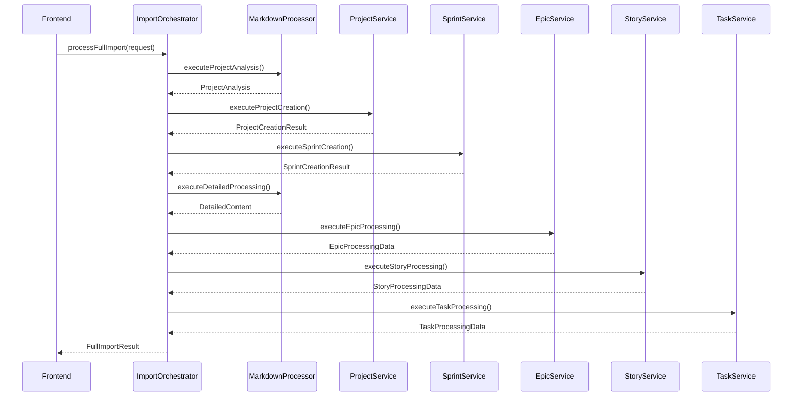

# Servicios Detallados del Sistema de Importación

## 📚 Índice de Servicios

1. [ImportOrchestrator](#importorchestrator) - Coordinador principal
2. [MarkdownProcessor](#markdownprocessor) - Procesamiento de IA
3. [ProjectCreationService](#projectcreationservice) - Creación de proyectos
4. [SprintGenerationService](#sprintgenerationservice) - Generación de sprints
5. [EpicProcessingService](#epicprocessingservice) - Procesamiento de épicas
6. [StoryProcessingService](#storyprocessingservice) - Procesamiento de historias
7. [TaskProcessingService](#taskprocessingservice) - Procesamiento de tareas

---

## ImportOrchestrator

**Archivo**: `src/app/lib/supabase/import-orchestrator.service.ts`
**Rol**: Coordinador maestro del flujo completo de importación

### 🎯 Responsabilidades

- Ejecutar las 8 fases del procesamiento en orden secuencial
- Manejar errores y rollbacks automáticos
- Consolidar feedback de todas las fases
- Generar estadísticas finales del proyecto

### 🔧 Métodos Principales

```typescript
class ImportOrchestrator {
  /**
   * Flujo completo de importación
   * @param request - Datos de entrada (markdown + usuario)
   * @returns Resultado completo con todas las fases
   */
  async processFullImport(request: ImportRequest): Promise<FullImportResult>
  
  // Métodos privados por fase
  private async executeProjectAnalysis(markdown: string): Promise<ImportPhaseResult>
  private async executeProjectCreation(projectAnalysis: ProjectAnalysis, ownerId: string): Promise<ImportPhaseResult>
  private async executeSprintCreation(projectId: string, epics: EpicBasicInfo[]): Promise<ImportPhaseResult>
  private async executeDetailedProcessing(markdown: string, projectAnalysis: ProjectAnalysis, assigneeId: string): Promise<ImportPhaseResult>
  private async executeEpicProcessing(epics: EpicBasicInfo[], projectId: string, sprintMappings: SprintMapping[]): Promise<ImportPhaseResult>
  private async executeStoryProcessing(stories: StoryImport[], projectId: string, createdEpics: EpicRow[], epicSprintMapping: Record<string, string>, assigneeId: string): Promise<ImportPhaseResult>
  private async executeTaskProcessing(tasks: TaskImport[], projectId: string, createdEpics: EpicRow[], createdStories: IssueRow[], epicSprintMapping: Record<string, string>, assigneeId: string): Promise<ImportPhaseResult>
}
```

### 📊 Flujo de Ejecución



### ⚠️ Manejo de Errores

```typescript
private buildFailureResult(
  result: FullImportResult, 
  errorMessage: string, 
  projectId?: string
): FullImportResult {
  result.success = false;
  result.feedback!.errors.push({
    type: 'CRITICAL',
    message: errorMessage
  });

  // TODO: Implementar rollback/cleanup si es necesario
  if (projectId) {
    console.warn(`⚠️ Proyecto ${projectId} puede necesitar limpieza manual`);
  }

  return result;
}
```

---

## MarkdownProcessor

**Archivo**: `src/app/lib/ai/markdown-processor.ts`
**Rol**: Interfaz con OpenAI para procesamiento inteligente

### 🤖 Estrategia Híbrida

#### Primera Llamada: Análisis del Proyecto
```typescript
static async processProjectAnalysis(markdown: string): Promise<ProjectAnalysis> {
  const result = await generateObject({
    model: openai('gpt-4o-mini'),
    schema: ProjectAnalysisSchema,
    schemaName: 'projectAnalysis',
    prompt: this.createProjectAnalysisPrompt(markdown),
    temperature: 0.1,
  });
  return result.object;
}
```

**Extrae**:
- ✅ Metadatos del proyecto (nombre, descripción, código)
- ✅ Épicas principales con prioridades textuales
- ✅ Estimaciones de complejidad y tamaño de equipo
- ✅ Duración estimada por épica

#### Segunda Llamada: Contenido Detallado
```typescript
static async processDetailedContent(
  markdown: string, 
  projectAnalysis: ProjectAnalysis, 
  assigneeId: string
): Promise<DetailedContent> {
  const prompt = this.createDetailedContentPrompt(markdown, projectAnalysis, assigneeId);
  // ... procesamiento con contexto
}
```

**Extrae**:
- ✅ Historias de usuario completas
- ✅ Tareas técnicas (FE/BE/OPS/DOCS/TEST)
- ✅ Vinculaciones entre elementos
- ✅ Auto-completado de información faltante

### 🎨 Prompts Inteligentes

```typescript
private static createProjectAnalysisPrompt(markdown: string): string {
  return `
Como experto en gestión de proyectos ágiles, analiza este documento markdown para extraer:

1. **METADATOS DEL PROYECTO:**
   - Nombre del proyecto (inferir del título o contenido)
   - Descripción breve del proyecto
   - Código sugerido (formato: PROJ-XXX basado en el nombre)
   - Duración estimada del proyecto

2. **ÉPICAS PRINCIPALES:**
   - Identificar las épicas principales del proyecto
   - Asignar prioridad (CRÍTICA, ALTA, MEDIA, BAJA, PENDIENTE)  // ← Cambio clave
   - Estimar duración en semanas por épica (1-12 semanas)
   - Extraer objetivo/descripción de cada épica

// ... resto del prompt
`;
}
```

### 🛡️ Fallbacks y Recuperación

```typescript
} catch (error) {
  console.error('Error en análisis inicial del proyecto:', error);
  
  // Fallback básico para mantener el flujo
  return {
    projectMetadata: {
      name: 'Proyecto Importado',
      suggestedCode: 'IMPORT-' + Date.now().toString().slice(-6),
      description: 'Proyecto generado automáticamente desde markdown'
    },
    epics: [],
    estimatedComplexity: 'MEDIUM',
    suggestedTeamSize: 1
  };
}
```

---

## ProjectCreationService

**Archivo**: `src/app/lib/supabase/project-creation.service.ts`
**Rol**: Creación automática de proyectos

### 🏗️ Proceso de Creación

```typescript
class ProjectCreationService {
  /**
   * Valida que el usuario tenga permisos para crear proyectos
   */
  async validateUserPermissions(userId: string): Promise<{
    canCreate: boolean;
    error?: string;
  }>

  /**
   * Crea un nuevo proyecto a partir de los metadatos analizados por IA
   */
  async createProject(
    metadata: ProjectMetadata,
    ownerId: string
  ): Promise<{
    result?: ProjectCreationResult;
    error?: string;
  }>
}
```

### 📋 Algoritmo de Código Único

```typescript
private generateUniqueCode(suggestedCode: string): string {
  // Normalizar sugerencia de IA
  let baseCode = suggestedCode
    .toUpperCase()
    .replace(/[^A-Z0-9]/g, '')
    .substring(0, 8);

  // Fallback si el código está vacío
  if (!baseCode) {
    baseCode = 'PROJ-' + Date.now().toString().slice(-6);
  }

  // TODO: Verificar unicidad en base de datos
  return baseCode;
}
```

### 🔍 Validación de Permisos

```typescript
async validateUserPermissions(userId: string): Promise<ValidationResult> {
  try {
    const { data: user } = await this.supabase
      .from('users')
      .select('id, role, active')
      .eq('id', userId)
      .single();

    if (!user) {
      return { canCreate: false, error: 'Usuario no encontrado' };
    }

    if (!user.active) {
      return { canCreate: false, error: 'Usuario inactivo' };
    }

    // Todos los usuarios activos pueden crear proyectos
    return { canCreate: true };
    
  } catch (error) {
    console.error('Error validando permisos:', error);
    return { canCreate: false, error: 'Error de conectividad' };
  }
}
```

---

## SprintGenerationService

**Archivo**: `src/app/lib/supabase/sprint-generation.service.ts`
**Rol**: Generación automática de sprints secuenciales

### 🏃‍♂️ Estrategia: 1 Sprint por Épica

```typescript
class SprintGenerationService {
  /**
   * Genera sprints automáticamente: un sprint por cada épica
   * Ordenados por prioridad textual y fechas secuenciales
   */
  async generateSprintsFromEpics(
    projectId: string,
    epics: EpicBasicInfo[]
  ): Promise<{ result?: SprintCreationResult; error?: string }>
}
```

### 🔄 Ordenamiento por Prioridad

```typescript
private comparePriorities(a: string, b: string): number {
  const priorityOrder = {
    'CRÍTICA': 1,    // Más importante
    'ALTA': 2,
    'MEDIA': 3,
    'BAJA': 4,
    'PENDIENTE': 5   // Menos importante
  };
  
  const orderA = priorityOrder[a as keyof typeof priorityOrder] || 6;
  const orderB = priorityOrder[b as keyof typeof priorityOrder] || 6;
  
  return orderA - orderB;
}
```

### 📅 Algoritmo de Fechas

```typescript
private generateSprintDates(epics: EpicBasicInfo[]): Array<{
  startDate: string;
  endDate: string;
}> {
  const dates = [];
  
  // Comenzar el próximo lunes
  const startDate = this.getNextMonday();
  let currentDate = new Date(startDate);

  for (const epic of epics) {
    const sprintStart = new Date(currentDate);
    
    // Duración: 2-4 semanas según estimación de la épica
    const sprintWeeks = Math.max(2, Math.min(epic.estimatedWeeks, 4));
    const sprintEnd = new Date(sprintStart);
    sprintEnd.setDate(sprintEnd.getDate() + (sprintWeeks * 7) - 1);
    
    dates.push({
      startDate: sprintStart.toISOString().split('T')[0],
      endDate: sprintEnd.toISOString().split('T')[0],
    });

    // Siguiente sprint: lunes después del viernes anterior
    currentDate = new Date(sprintEnd);
    currentDate.setDate(currentDate.getDate() + 3); // Viernes + 3 = Lunes
  }

  return dates;
}
```

### 🎯 Capacidad por Prioridad

```typescript
private getPriorityMultiplier(priority: string): number {
  switch (priority) {
    case 'CRÍTICA':   return 1.3; // +30% más capacidad
    case 'ALTA':      return 1.1; // +10% más capacidad  
    case 'MEDIA':     return 1.0; // Capacidad normal
    case 'BAJA':      return 0.9; // -10% capacidad
    case 'PENDIENTE': return 0.8; // -20% capacidad
    default:          return 1.0;
  }
}
```

---

## EpicProcessingService

**Archivo**: `src/app/lib/supabase/epic-processing.service.ts`
**Rol**: Conversión de épicas de IA a entidades de base de datos

### 🎯 Procesamiento de Épicas

```typescript
class EpicProcessingService {
  /**
   * Procesa épicas y las vincula con sus sprints correspondientes
   */
  async processEpics(
    epics: EpicBasicInfo[],
    projectId: string,
    sprintMappings: SprintMapping[]
  ): Promise<{
    epics?: EpicRow[];
    error?: string;
  }>

  /**
   * Valida estructura y contenido de las épicas
   */
  validateEpics(epics: EpicBasicInfo[]): {
    isValid: boolean;
    errors: string[];
    validEpics: EpicBasicInfo[];
  }
}
```

### 🔗 Mapeo Épica → Sprint

```typescript
// Crear mapeo de épicas a sprints
const sprintByEpic: Record<string, string> = {};
sprintMappings.forEach(mapping => {
  sprintByEpic[mapping.epicId] = mapping.sprintId;
});

// Transformar cada épica
const epicInserts: EpicInsert[] = validEpics.map(epic => ({
  project_id: projectId,
  key: epic.id,
  title: epic.title,
  description: epic.objective || `Épica: ${epic.title}`,
  status: 'planned',
  priority: this.mapPriorityToDatabase(epic.priority),
  labels: [epic.priority.toLowerCase()],
  created_at: new Date().toISOString(),
  updated_at: new Date().toISOString(),
}));
```

### 🔄 Mapeo de Prioridades

```typescript
private mapPriorityToDatabase(priority: string): string {
  const priorityMap = {
    'CRÍTICA': 'critical',
    'ALTA': 'high', 
    'MEDIA': 'medium',
    'BAJA': 'low',
    'PENDIENTE': 'low'
  };
  
  return priorityMap[priority as keyof typeof priorityMap] || 'medium';
}
```

---

## StoryProcessingService + TaskProcessingService

**Archivos**: 
- `src/app/lib/supabase/story-processing.service.ts`
- `src/app/lib/supabase/task-processing.service.ts`

### 📚 Patrón Común de Procesamiento

Ambos servicios siguen el mismo patrón arquitectónico:

```typescript
interface ProcessingService<TInput, TOutput> {
  // Validación de entrada
  validate(items: TInput[]): {
    isValid: boolean;
    errors: string[];
    validItems: TInput[];
  };
  
  // Procesamiento principal
  process(
    items: TInput[], 
    projectId: string,
    context: ProcessingContext,
    assigneeId: string
  ): Promise<{
    items?: TOutput[];
    error?: string;
  }>;
}
```

### 🔗 Vinculación Inteligente

#### StoryProcessingService
```typescript
// Vincula historias con épicas
const epicByKey: Record<string, EpicRow> = {};
createdEpics.forEach(epic => {
  epicByKey[epic.key] = epic;
});

const storyInserts: IssueInsert[] = validStories.map(story => {
  const parentEpic = epicByKey[story.epicId];
  const sprintId = epicSprintMapping[story.epicId];
  
  return {
    project_id: projectId,
    key: story.id,
    type: 'story',
    status: 'todo',
    priority: 'medium',
    summary: story.title,
    description: story.description,
    assignee_id: assigneeId,
    reporter_id: assigneeId,
    sprint_id: sprintId,
    story_points: story.storyPoints,
    acceptance_criteria: story.acceptanceCriteria,
    // ... más campos
  };
});
```

#### TaskProcessingService
```typescript
// Vincula tareas con historias/épicas
const issueInserts: IssueInsert[] = validTasks.map(task => {
  // Prioriza vinculación a historia si existe
  const parentStory = task.storyId ? storyByKey[task.storyId] : null;
  const parentEpic = task.epicId ? epicByKey[task.epicId] : null;
  
  // Determina sprint desde la historia o épica padre
  const sprintId = parentStory?.sprint_id || 
                   (task.epicId ? epicSprintMapping[task.epicId] : null);
  
  return {
    project_id: projectId,
    key: task.id,
    type: 'task',
    status: 'todo',
    priority: this.mapTaskPriority(task.type), // FE/BE/OPS/etc → priority
    summary: task.title,
    description: task.description,
    assignee_id: assigneeId, // ← Siempre el desarrollador fijo
    reporter_id: assigneeId,
    sprint_id: sprintId,
    labels: [task.type.toLowerCase()],
    // ... más campos
  };
});
```

### 🏷️ Mapeo de Tipos de Tareas

```typescript
private mapTaskPriority(taskType: string): string {
  const priorityMap = {
    'FE': 'medium',    // Frontend
    'BE': 'high',      // Backend (más crítico)
    'OPS': 'high',     // Operaciones (crítico)
    'DOCS': 'low',     // Documentación
    'TEST': 'medium'   // Testing
  };
  
  return priorityMap[taskType] || 'medium';
}
```

---

## 🔍 Validaciones Comunes

Todos los servicios implementan validaciones robustas:

### ✅ Validación de IDs Únicos
```typescript
const ids = items.map(item => item.id);
const uniqueIds = new Set(ids);
if (ids.length !== uniqueIds.size) {
  errors.push('IDs duplicados encontrados');
}
```

### ✅ Validación de Referencias
```typescript
// Verificar que epicId existe
if (!epicIds.has(story.epicId)) {
  errors.push(`Historia ${story.id} referencia épica inexistente: ${story.epicId}`);
}
```

### ✅ Validación de Campos Requeridos
```typescript
if (!item.title || item.title.trim() === '') {
  errors.push(`Elemento ${item.id} sin título válido`);
}
```

---

Esta arquitectura de servicios garantiza **procesamiento confiable**, **validación exhaustiva** y **mantenibilidad** a largo plazo.
